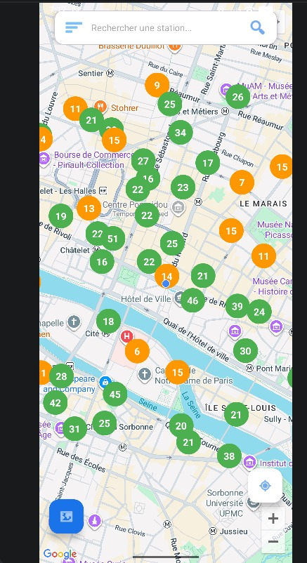
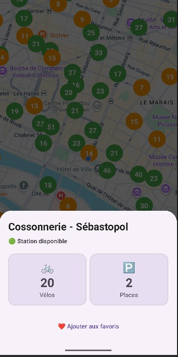
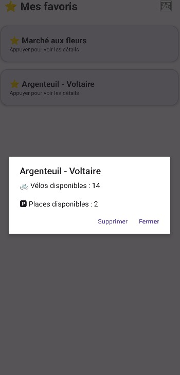
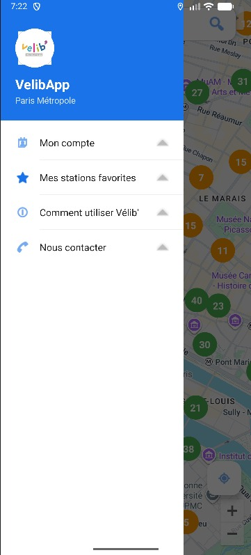
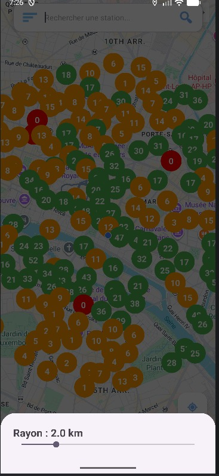

# VelibApp - Application Android

## Présentation

VelibApp est une application Android développée en Kotlin dans le cadre d'un projet universitaire.

L'objectif de l'application est de permettre aux utilisateurs de consulter les stations Vélib' Métropole de Paris en temps réel, d'accéder aux informations détaillées de chaque station, de gérer une liste de favoris et de localiser facilement les stations à proximité.

L'application s'appuie sur les données Open Data de Vélib' Métropole et propose une interface intuitive facilitant la recherche et la consultation des stations.

---

## Fonctionnalités

- 🗺️ Affichage des stations Vélib' sur une carte interactive.
- 📍 Géolocalisation de l'utilisateur.
- 🔍 Recherche d'une station.
- 📏 Filtrage des stations selon un rayon de recherche.
- 🚲 Consultation des informations détaillées d'une station.
- ⭐ Ajout et suppression de stations favorites.
- 💾 Consultation des favoris hors connexion.
- 👤 Création de compte et authentification utilisateur.

---

## Technologies utilisées

- Kotlin
- Android Studio
- Google Maps SDK
- API Vélib' Métropole
- Material Design

---

## Captures d'écran

### Carte des stations

### Détail d'une station

### Gestion des favoris

### Connexion utilisateur

### Menu de navigation

### Filtre par rayon

---

## Auteurs

Projet réalisé en binôme par :

- Yan DIBANTSA
- Will POATY

---

## Documentation

Le manuel utilisateur est disponible dans le fichier :

`Manuel_d'utilisation.pdf`